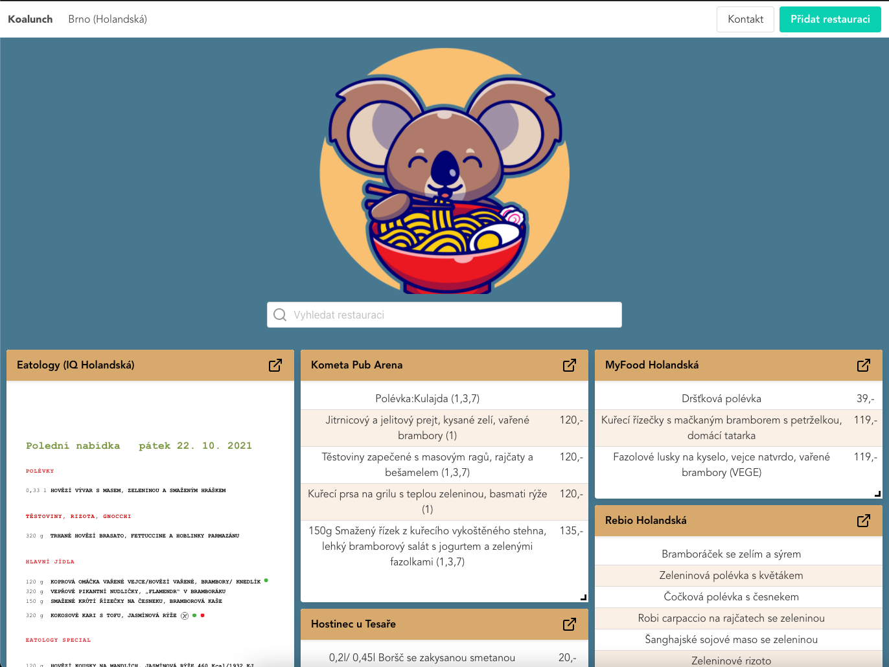

# Koalunch

[](https://github.com/Narvio/koalunch/actions/workflows/unit-tests.yml)

Hosted at https://koalunch.azurewebsites.net/

Created by [Narvio](https://narvio.github.io/)

Client part of the Koalunch - daily menu information for restaurants around CTPark Brno Holandská. For more information see the [backend part](https://github.com/Narvio/koalunch-api/).



## Supported languages

Based on browser confuration

- English
- Czech

## Project setup

```
npm install
```

### Compiles and hot-reloads for development

```
npm run serve
```

### Compiles and minifies for production

```
npm run build
```

### Run your unit tests

```
npm run test:unit
```

### Lints and fixes files

```
npm run lint
```

## Technologies used

- [TypeScript](https://www.typescriptlang.org/)
- [vuejs](https://vuejs.org/) v3
- [vue-grid-layout](https://github.com/jbaysolutions/vue-grid-layout) for layouting
- [vue-i18n](https://kazupon.github.io/vue-i18n/) for internationalization
- [vuex](https://vuex.vuejs.org/) for state management
- [pdfjs](https://mozilla.github.io/pdf.js/) as PDF rendering engine
- [Bulma](https://bulma.io/) as CSS framework
- [mocha](https://mochajs.org/) + [chai](https://www.chaijs.com/) for unit tests

<p align="center">
  
</p>
